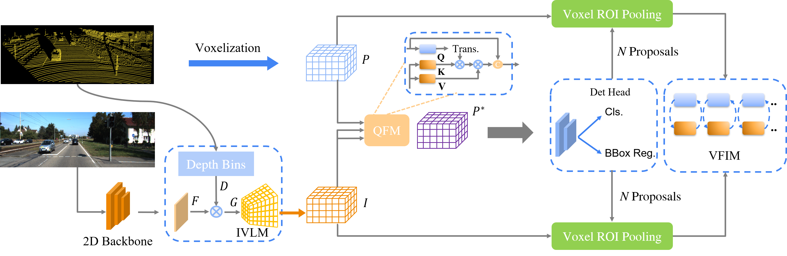

## HMFI
<br/>

> Homogeneous Multi-modal Feature Fusion and Interaction for 3D Object Detection (Paper and Codes Coming Soon ~) 

<p align='center'>

</p>


## KITTI 

The results are the 3D detection performance of moderate difficulty on the val set of KITTI dataset.

| Model | Car@R11 | Pedestrian@R11 | Cyclist@R11 |
| -|-|-|-|
| SECOND |  78.27 | 53.23 | 65.64 |
| SECOND+HMFI | 78.72 | 55.32 | 69.13|
| Voxel-RCNN |  84.27 | 60.11 | 72.07 |
| Voxel-RCNN+HMFI | 85.14 | 62.41 | 74.11|

## Installation
Please refer to [INSTALL.md](docs/INSTALL.md).

## Getting Started
Please refer to [GETTING_STARTED.md](docs/GETTING_STARTED.md).

## Acknowledgement

Our code is heavily based on [OpenPCDet](https://github.com/open-mmlab/OpenPCDet/tree/v0.2.0) and [MMDetection](https://github.com/open-mmlab/mmdetection). Thanks their awesome codebase.

## Citation

If you find this project useful in your research, please consider cite:
```

```